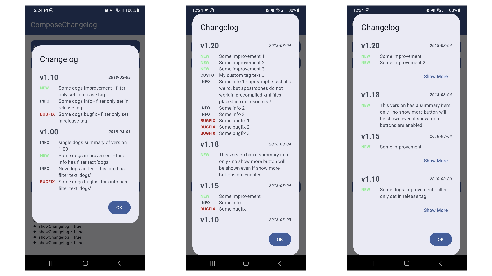

### About

This library offers you a a **changelog dialog** for compose including the ability to show new logs on app start only as well as filtering and customisation.

## :camera: Screenshots

|  |
| :-: |

## :book: Documentation

The readme for this library with **code samples**, **screenshots** and more can be found on following *github page*:

Additionally there is also a full working [demo app](demo) inside the *demo module*.