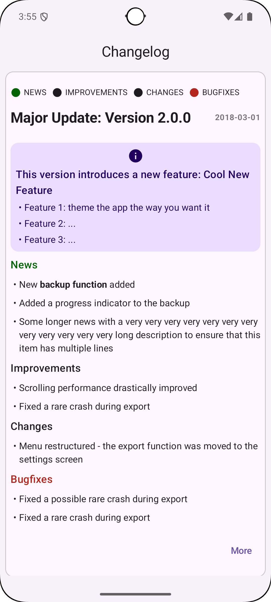
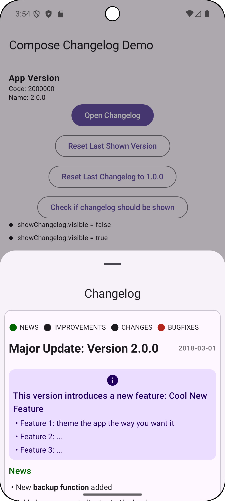
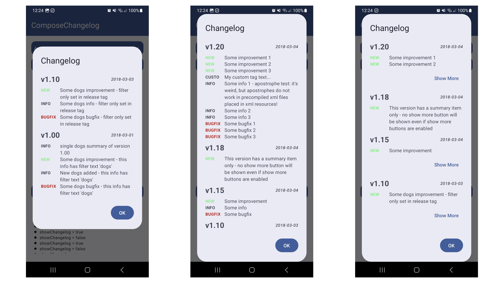

[](https://central.sonatype.com/artifact/io.github.mflisar.composechangelog/core)   
# ComposeChangelog
     

* filtering
    * useful to filter out uninteresting old changelog entries on app start
    * useful for filtering changelog based on build flavour
* also supports automatic handling of showing changelogs on app start (uses preference to save last seen changelog version and handles everything for you automatically to only show **new changelogs** and only show those once)
* customise look
    * you can provide custom composables for every item type if desired
    * you can provide custom version name formatter
    * you can provide a custom sorter
* supports raw and xml resources, default resource name is `changelog.xml` in raw folder
* supports summaries with a "show more" button
* optional provides a `gradle plugin` that allows you to convert version names automatically to version numbers

# Table of Contents

- [Screenshots](#camera-screenshots)
- [Supported Platforms](#computer-supported-platforms)
- [Versions](#arrow_right-versions)
- [Setup](#wrench-setup)
- [Usage](#rocket-usage)
- [Modules](#file_folder-modules)
- [Demo](#sparkles-demo)
- [More](#information_source-more)
- [API](#books-api)
- [Other Libraries](#bulb-other-libraries)

# :camera: Screenshots





# :computer: Supported Platforms

| Module | android | iOS | windows | macOS | wasm |
|---|---|---|---|---|---|
| core | ✅ | ✅ | ✅ | ✅ | ✅ |
| renderer-header | ✅ | ✅ | ✅ | ✅ | ✅ |
| statesaver-kotpreferences | ✅ | ✅ | ✅ | ✅ | ✅ |
| statesaver-preferences | ✅ | ✅ | ✅ | ✅ | ❌ |

# :arrow_right: Versions

| Dependency | Version |
|---|---|
| Kotlin | `2.3.20` |
| Jetbrains Compose | `1.10.3` |
| Jetbrains Compose Material3 | `1.9.0` |

# :wrench: Setup

<details open>

<summary><b>Using Version Catalogs</b></summary>

<br>

Define the dependencies inside your **libs.versions.toml** file.

```toml
[versions]

composechangelog = "<LATEST-VERSION>"

[libraries]

composechangelog-core = { module = "io.github.mflisar.composechangelog:core", version.ref = "composechangelog" }
composechangelog-renderer-header = { module = "io.github.mflisar.composechangelog:renderer-header", version.ref = "composechangelog" }
composechangelog-statesaver-kotpreferences = { module = "io.github.mflisar.composechangelog:statesaver-kotpreferences", version.ref = "composechangelog" }
composechangelog-statesaver-preferences = { module = "io.github.mflisar.composechangelog:statesaver-preferences", version.ref = "composechangelog" }
```

And then use the definitions in your projects **build.gradle.kts** file like following:

```java
implementation(libs.composechangelog.core)
implementation(libs.composechangelog.renderer.header)
implementation(libs.composechangelog.statesaver.kotpreferences)
implementation(libs.composechangelog.statesaver.preferences)
```

</details>

<details>

<summary><b>Direct Dependency Notation</b></summary>

<br>

Simply add the dependencies inside your **build.gradle.kts** file.

```kotlin
val composechangelog = "<LATEST-VERSION>"

implementation("io.github.mflisar.composechangelog:core:${composechangelog}")
implementation("io.github.mflisar.composechangelog:renderer-header:${composechangelog}")
implementation("io.github.mflisar.composechangelog:statesaver-kotpreferences:${composechangelog}")
implementation("io.github.mflisar.composechangelog:statesaver-preferences:${composechangelog}")
```

</details>

# :rocket: Usage

#### Define your changelog as xml file

```xml
<changelog>

    <release versionName="2.0.0" date="2018-03-01" title="Major Update: Version 2.0.0">

        <!-- optional header -->
        <header icon="Info">
            <title>This version introduces a new feature: Cool New Feature</title>
            <infos>
                <item>Feature 1: theme the app the way you want it</item>
                <item>Feature 2: ...</item>
                <item>Feature 3: ...</item>
            </infos>
        </header>

        <!-- news -->
        <news>
            <item>New <b>backup function</b> added</item>
            <item>Added a progress indicator to the backup</item>
            <item>Some longer news with a very very very very very very very very very very very very long description to ensure that this item has multiple lines</item>
        </news>

        <!-- improvements -->
        <improvements>
            <item>Scrolling performance drastically improved</item>
            <item>Fixed a rare crash during export</item>
        </improvements>

        <!-- changes -->
        <changes>
            <item>Menu restructured - the export function was moved to the settings screen</item>
        </changes>

        <!-- bugfixes -->
        <bugfixes>
            <item>Fixed a possible rare crash during export</item>
            <item>Fixed a rare crash during export</item>
            <more>
                <item>Fixed a small internal bug</item>
                <item>Fixed another small internal bug</item>
                <item>And another one...</item>
                <item>And another one...</item>
                <item>And another one...</item>
                <item>And another one...</item>
            </more>
        </bugfixes>
    </release>

    <release versionName="1.0.1" date="2018-02-01">
        <!-- bugfixes -->
        <bugfixes>
            <item>Severe crash when opening the settings screen fixed</item>
        </bugfixes>
    </release>

    <release versionName="1.0.0" date="2018-01-01">
        <!-- optional header -->
        <header icon="Outlined.Warning">
            <title>First release version</title>
            <item>We finally made it - this is the first stable release version</item>
        </header>
        <!-- news -->
        <news>
            <item>New backup function added</item>
            <item>Added a progress indicator to the backup</item>
        </news>
        <!-- improvements -->
        <improvements>
            <item>Scrolling performance drastically improved</item>
            <item>Fixed a rare crash during export</item>
        </improvements>
        <!-- changes -->
        <changes>
            <item>Menu restructured - the export function was moved to the settings screen</item>
        </changes>
        <!-- bugfixes -->
        <bugfixes>
            <item>Fixed a possible rare crash during export</item>
            <item>Fixed a rare crash during export</item>
            <more>
                <item>Fixed a small internal bug</item>
                <item>Fixed another small internal bug</item>
            </more>
        </bugfixes>
    </release>

</changelog>
```

!!! info

    * the header tag only works if you add the `renderer-header` module!
    * supported icons for the header tag must be defined by yourself (the icon is optional though)

#### Show the interesting parts of the changelog on app start

```kotlin

// define a version formatter that can convert between a version number and a version string
val CHANGELOG_FORMATTER = DefaultVersionFormatter(DefaultVersionFormatter.Format.MajorMinorPatchCandidate)

 // 1) we need a state saver to persist the version for which the changelog was last shown
// use either of the following 2 or implement the corresponding interface yourself

// saves the last shown version inside a preference file
val changelogStateSaver = remember {
    ChangelogStateSaverPreferences.create(context) // context must only be provided on android!
}

// ALTERNATIVE: if you use my kotpreference library like this demo you can do following:
val changelogStateSaverKotPrefs = remember {
    ChangelogStateSaverKotPreferences(DemoPrefs.lastShownVersionForChangelog)
}

// 2) optional - here you can apply some customisations like changelog resource id, localized texts, styles, filter, sorter, renderer...
val setup = ChangelogDefaults.setup(context = context) // context must only be provided on android!

// 3) show the changelog for the app start - this will only show the changelogs that the user did not see yet
val versionName = Changelog.getAppVersionName(context)
val changelogState = rememberChangelogState()
// initially we check if we need to show the changelog
// this is optional of course...
LaunchedEffect(Unit) {
    changelogState.checkShouldShowChangelogOnStart(
        changelogStateSaver,
        versionName,
        CHANGELOG_FORMATTER
    )
}
```

#### Show the full changelog

```kotlin
Button(
    onClick = {
        changelogState.show()
    }
) {
    Text("Show Changelog")
}
```

#### Header renderer

If you want to use the header renderer, add the module and register the renderer like following:

```kotlin
// in this example we define a renderer that can render 3 icons for the header - this optional
Changelog.registerRenderer(
    ChangelogHeaderRenderer {
        val icon = when (it?.lowercase()) {
            "info" -> Icons.Default.Info
            "new" -> Icons.Default.NewReleases
            "warning" -> Icons.Default.Warning
            else -> null
        }
        if (icon != null) {
            Icon(imageVector = icon, contentDescription = null)
        }
    }
)
```

# :file_folder: Modules

- [Statesaver KotPreferences](documentation/Modules/Statesaver%20KotPreferences.md)
- [Statesaver Preferences](documentation/Modules/Statesaver%20Preferences.md)
- [core](documentation/Modules/core.md)

# :sparkles: Demo

A full [demo](/demo) is included inside the demo module, it shows nearly every usage with working examples.

# :information_source: More

- Advanced
  - [Gradle Plugin](documentation/Advanced/Gradle%20Plugin.md)

# :books: API

Check out the [API documentation](https://MFlisar.github.io/ComposeChangelog/).

# :bulb: Other Libraries

You can find more libraries (all multiplatform) of mine that all do work together nicely [here](https://mflisar.github.io/Libraries/).
